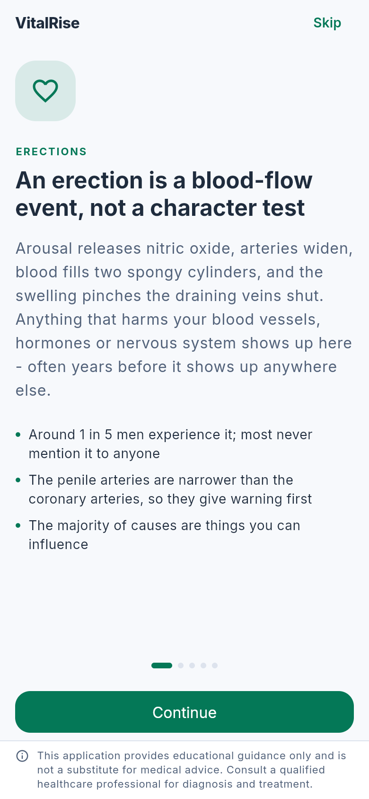
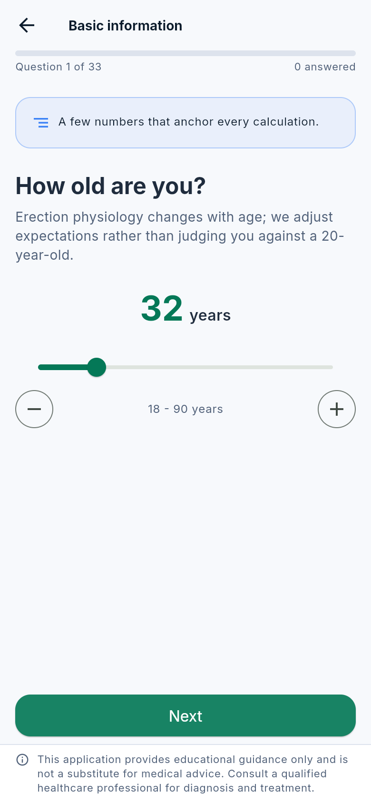
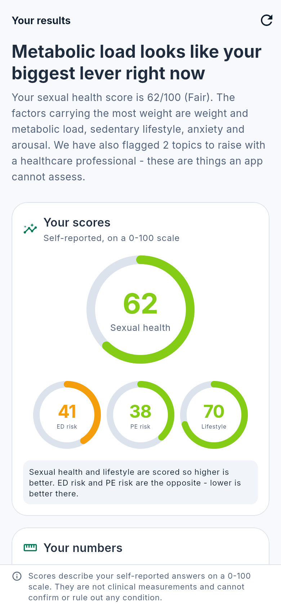
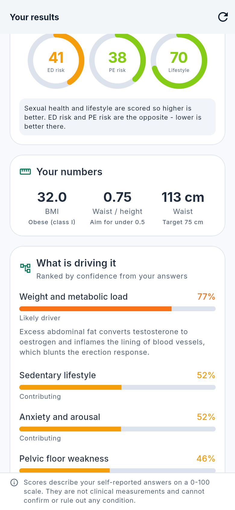

# VitalRise

An educational men's sexual wellness coach. Flutter, Riverpod, Supabase.

VitalRise takes a structured self-assessment, works out which *trainable*
factors are most likely driving a man's symptoms, and builds a 12-week
pelvic floor, nutrition and lifestyle programme around them — with an AI
coach grounded in a reviewed content library.

> **This is a wellness and education product, not a medical device.** It
> does not diagnose, treat, cure or prescribe. Every screen carries the
> disclaimer, and a test fails the build if one doesn't.

<p align="center">
  
  
  
  
</p>

*Real screenshots, captured by driving the running app in a browser at a
390x844 phone viewport.*

---

## What's here

| | |
| --- | --- |
| **Flutter app** | 55 Dart files. Onboarding, 33-question intake, scoring, 12-week programme, 22-exercise library with animations, nutrition engine, habit tracker, progress charts, AI coach, article library, anatomy section, settings. |
| **Domain engines** | Assessment scoring, root-cause analysis, programme builder, nutrition targets and meal planning — all pure Dart, no Flutter, fully tested. |
| **Backend** | Postgres schema, row-level security, two Edge Functions, cron jobs. |
| **Assets** | 22 generated Lottie animations - a rigged human figure per exercise, plus a pelvic-floor cutaway for Kegels - and 5 hand-authored anatomy SVGs. |
| **Tests** | 200 tests: engines, safety triage, crypto, assets, screens, navigation, offline-first sync, accessibility. |

## Get it on your phone

Two routes, neither of which needs a developer account or a Play Store
listing. Both build the **offline variant**: no backend, no sign-in, no
keys, fully functional on-device.

### 1. Install the Android APK

The `Build APK` GitHub Action produces an installable APK on every push and
attaches it to a rolling pre-release.

1. Repo → **Actions** → **Build APK** → **Run workflow** (or just push).
2. When it finishes, open the repo's **Releases** page *on your phone*.
3. Download `vitalrise-*.apk` and allow installs from your browser when
   Android asks.

It is signed with the standard Flutter debug key — fine for your own
device, not valid for the Play Store.

### 2. Open it in your phone's browser

The `Deploy web build` action publishes to GitHub Pages. Enable it once:
**Settings → Pages → Source: GitHub Actions**, then run the workflow. You
get `https://<user>.github.io/<repo>/`, which installs to the home screen
like an app.

Until Pages is enabled the workflow still builds the site and skips only
the publish step, so the run stays green and the built site is attached to
it as the `web-build` artifact. Enabling Pages needs a repository
permission the workflow token does not have, which is why the build cannot
do it for you.

The web build is the same code, with two caveats: local encryption uses
WebCrypto and IndexedDB rather than the platform keystore, and push
notifications do not apply. Good for trying it; the APK is better for
living with it.

## Running from source

```bash
flutter pub get

# Runs entirely on-device: encrypted local storage, offline coach,
# no account needed. This is a real mode, not a stub.
flutter run

# With a backend:
flutter run --dart-define-from-file=env/dev.json

# Web, with CanvasKit served from your own origin rather than a Google CDN.
flutter build web --release --no-web-resources-cdn
```

There is no configuration to write before the app does something useful.
`Env.isOfflineDemo` is true whenever no Supabase URL is defined, and the
app degrades to on-device storage and an extractive coach that quotes the
bundled library rather than calling a model.

Backend setup is in [`supabase/README.md`](supabase/README.md).

## Architecture in one screen

```
lib/
├── app/                    theme, router, providers, root widget
├── core/                   config, disclaimers, crypto, storage, analytics,
│                           shared widgets (incl. VitalScaffold)
├── data/
│   ├── remote/             RemoteSync interface + Supabase & noop impls
│   └── repositories/       offline-first repository
└── features/<feature>/
    ├── domain/             pure Dart: models + engines. No Flutter imports.
    ├── presentation/       screens and widgets
    └── ...
```

Three rules hold the structure together:

1. **`domain/` never imports Flutter.** That's what makes the scoring, diet
   and programme engines testable as plain functions, and it's why the
   assessment engine has 28 tests that run in milliseconds.
2. **Everything reads through `VitalRiseRepository`.** Local encrypted store
   first, remote sync second. A failed network write never blocks a user
   from logging a session.
3. **Every screen builds on `VitalScaffold`**, which renders the regulatory
   footer. `test/widget/app_widget_test.dart` scans the source and fails if
   a screen bypasses it.

More detail: [`docs/ARCHITECTURE.md`](docs/ARCHITECTURE.md).

## The scoring engine

The intake produces four scores and seven root-cause confidences. The
direction of the scores is not uniform, and it's the easiest thing to get
wrong when reading the code:

| Score | Direction |
| --- | --- |
| Sexual health | higher is better |
| Lifestyle | higher is better |
| ED risk | **higher is worse** |
| PE risk | **higher is worse** |

Every answer normalises to a *burden* in `0..1`, section scores are weighted
means, and unanswered questions are dropped and the weights renormalised —
so a partial intake is never silently scored as "all zeros".

Root causes get a couple of clinically-motivated modifiers on top of the
weighted sums. The most important: preserved morning erections alongside
difficulty during sex pushes confidence toward the anxiety category and away
from the vascular one, because that pattern demonstrates the plumbing works.

Full weight tables and rationale: [`docs/SCORING.md`](docs/SCORING.md).

## Safety model

Three layers, in order:

1. **On-device triage** (`coach_safety.dart`) runs before any network call.
   Self-harm, priapism, chest pain and similar return crisis resources
   immediately — an emergency answer must not depend on connectivity.
   Medication questions are refused with a redirect to a prescriber.
2. **Server-side triage** in the Edge Function repeats the same checks,
   because a server that trusts its callers has no guardrails.
3. **Grounded generation.** The model only sees passages retrieved from the
   bundled library, and the system prompt forbids diagnosis, medication
   advice and cure claims.

Beyond the coach, the assessment raises `ClinicalFlag`s — cardiovascular,
glycaemic, hormonal, mental health, sudden onset, compulsive use — which
route to "talk to a clinician" rather than to app content. Anything the app
cannot legitimately address is handed over rather than coached around.

## Privacy

- Health data is encrypted with AES-256-GCM before it touches disk; the key
  lives in the platform keystore.
- Coach conversations never leave the device.
- Analytics events are a closed enum of behavioural signals — no score, no
  answer, no measurement, by construction.
- Row-level security means the server can only ever return the caller's own
  rows.
- "Delete everything" destroys the local key and runs a transactional
  server-side delete.

Details and threat model: [`docs/SECURITY_PRIVACY.md`](docs/SECURITY_PRIVACY.md).

## Development

```bash
flutter analyze                       # zero issues expected
flutter test                          # 197 tests
flutter test --coverage
dart format --line-length 80 lib test tool

python3 tool/generate_animations.py   # regenerate Lottie assets
```

## Documentation

| Document | What's in it |
| --- | --- |
| [ARCHITECTURE.md](docs/ARCHITECTURE.md) | Layering, state management, data flow, scaling |
| [SCORING.md](docs/SCORING.md) | Every weight, every modifier, and why |
| [SECURITY_PRIVACY.md](docs/SECURITY_PRIVACY.md) | Threat model, encryption, HIPAA-inspired practice |
| [ANIMATION_ARCHITECTURE.md](docs/ANIMATION_ARCHITECTURE.md) | Lottie pipeline, fallbacks, production asset spec |
| [DEPLOYMENT.md](docs/DEPLOYMENT.md) | Build, sign, release, CI |
| [STORE_READINESS.md](docs/STORE_READINESS.md) | App Store and Play checklist for a health app |
| [TESTING.md](docs/TESTING.md) | What's covered, what isn't, how to extend |
| [supabase/README.md](supabase/README.md) | Schema, RLS, functions, key handling |

## Roadmap

The architecture is built for expansion into a full men's health platform.
The seams that make that cheap:

- `RootCause` is an enum with a stable `slug`, and content is tagged by
  cause — adding fertility or testosterone-optimisation tracks means new
  causes and new content, not a rewrite.
- `content_items` in Postgres overlays bundled content, so copy and new
  exercises ship without an app store release.
- `CoachBackend` is an interface; moving retrieval server-side to pgvector
  when the corpus outgrows on-device BM25 changes one implementation.
- The intake is data (`QuestionBank`), so new sections are additive and
  versioned via `content_version`.

## Licence

Proprietary. All rights reserved.
